# Method Call Diagram for cli.py main()

This diagram shows the method call flow for the `main()` function and all CLI commands in [cli.py](file:///home/userpc/29/ForgeOAgent/forgeoagent/cli.py).

## Main Entry Point Flow

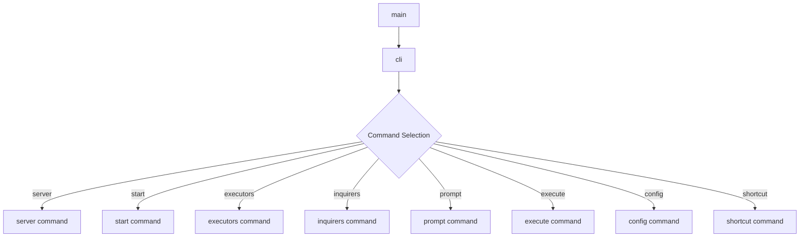

## Server Command Flow

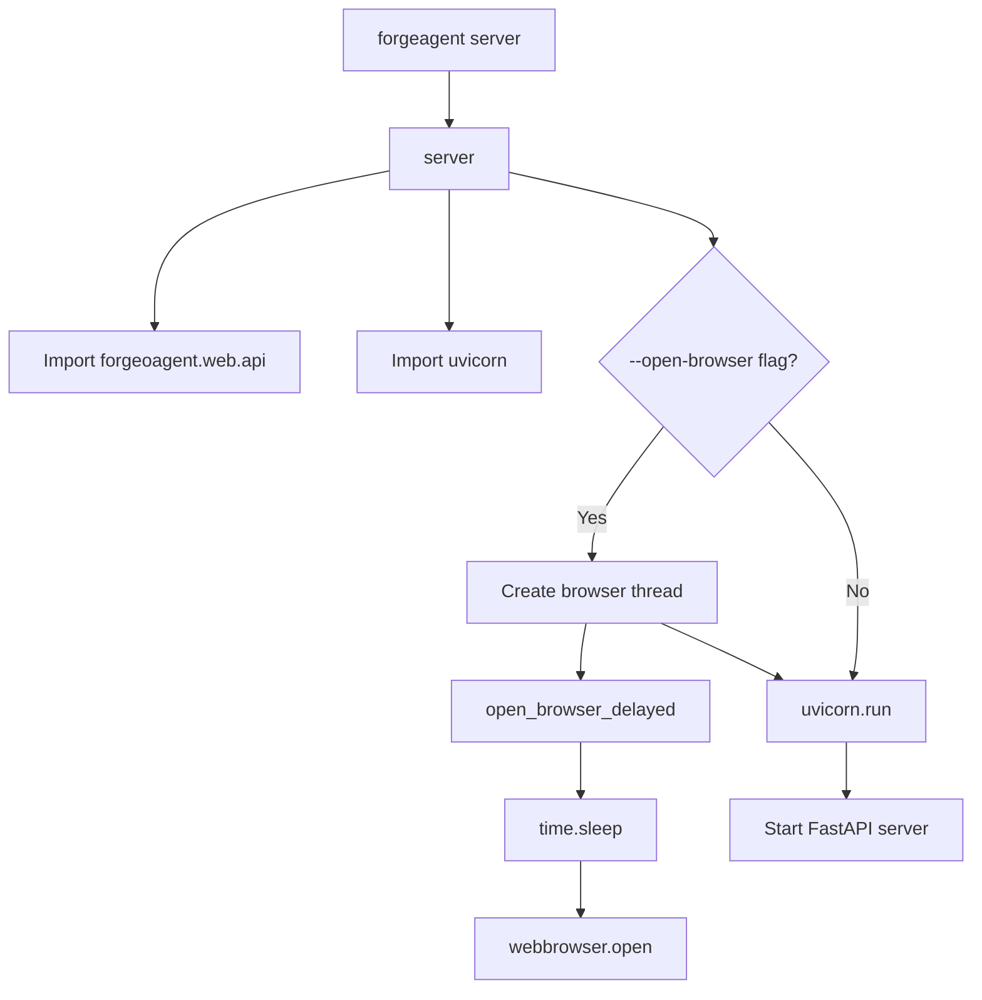

## Start Command Flow

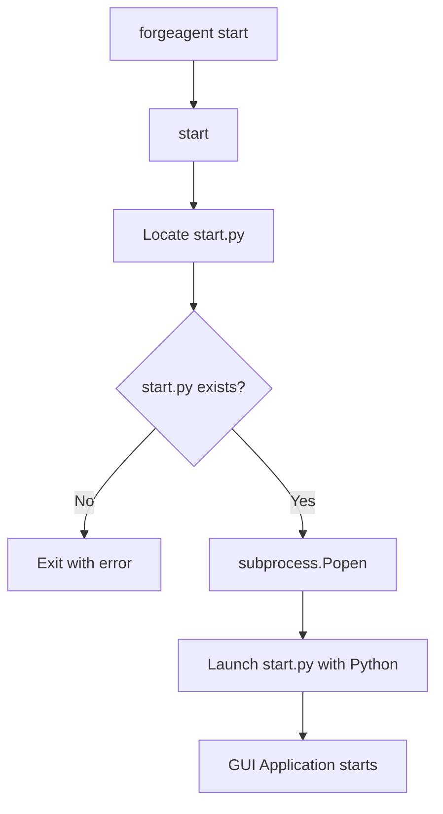

## Executors Command Flow

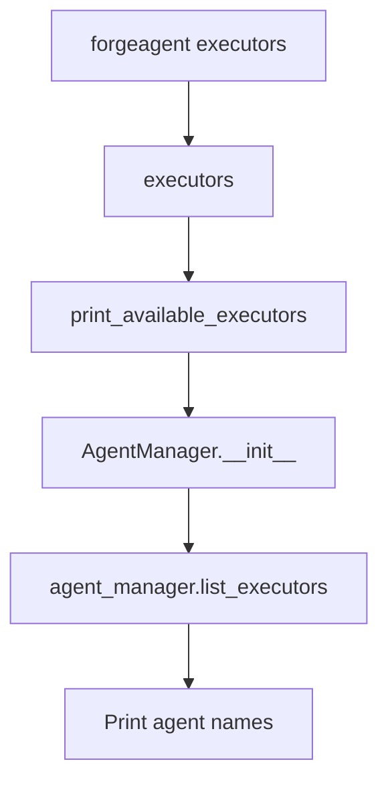

## Inquirers Command Flow

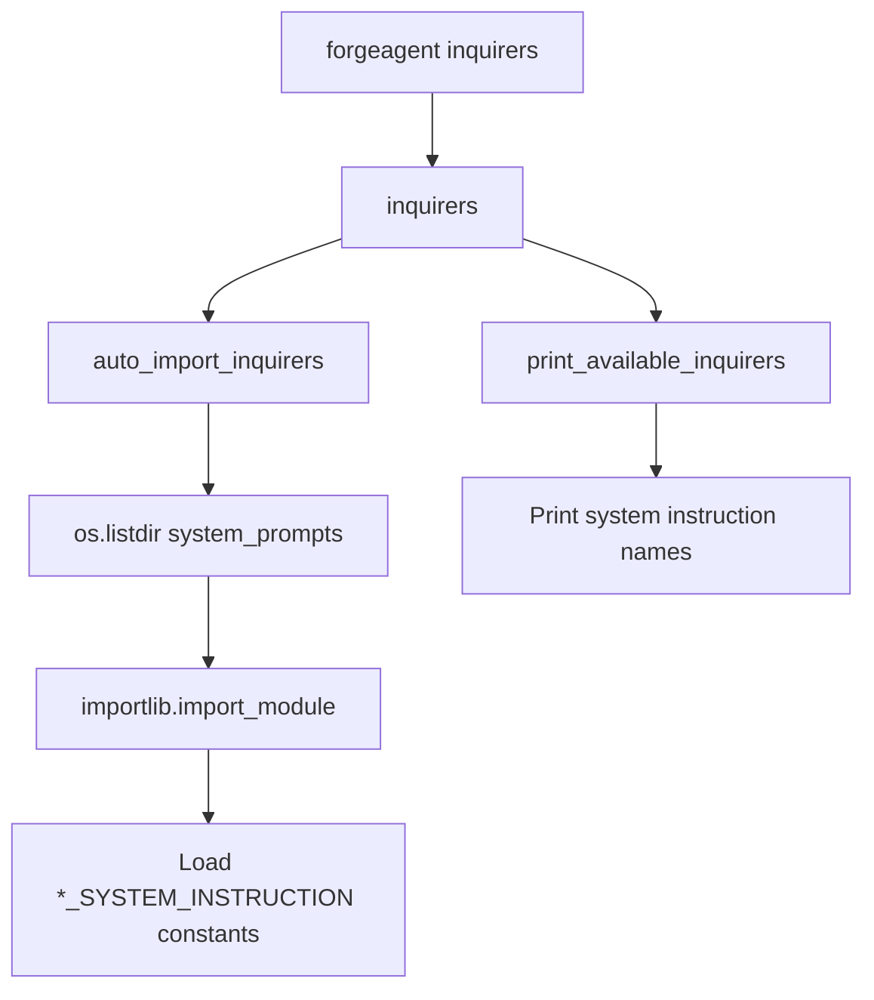

## Prompt Command Flow

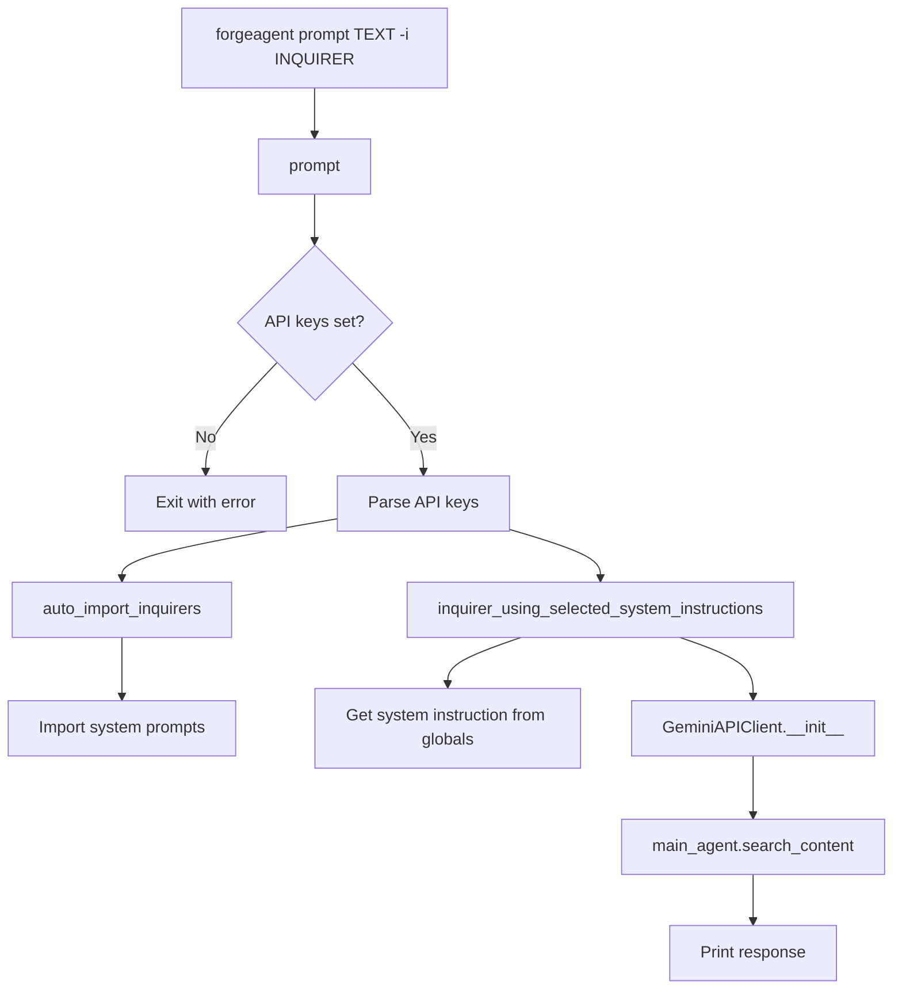

## Execute Command Flow

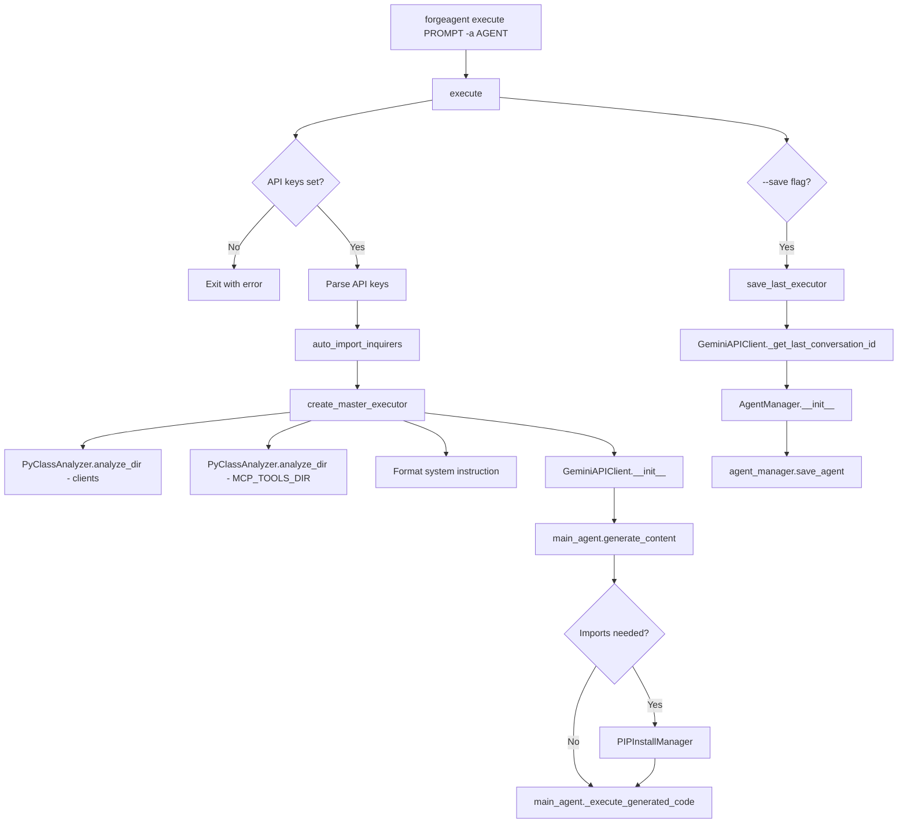

## Config Command Flow

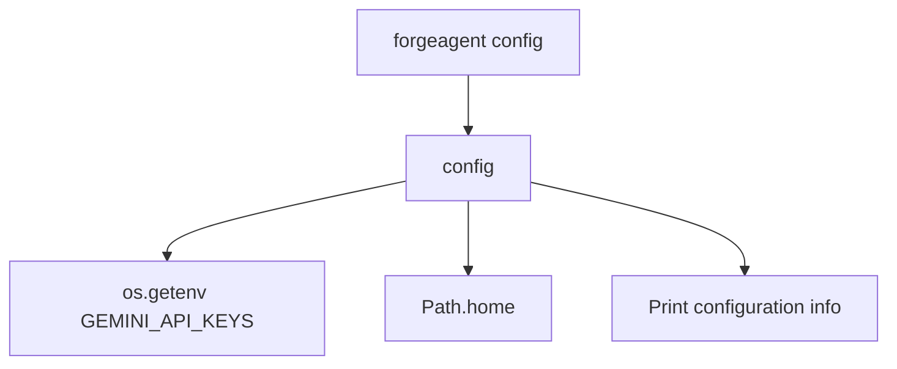

## Shortcut Command Flow

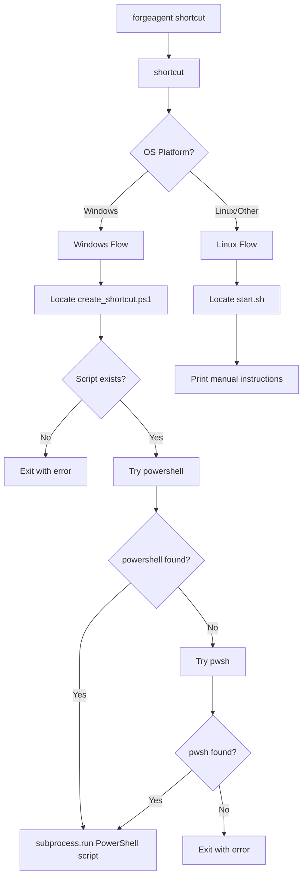

## Alternative Entry Point

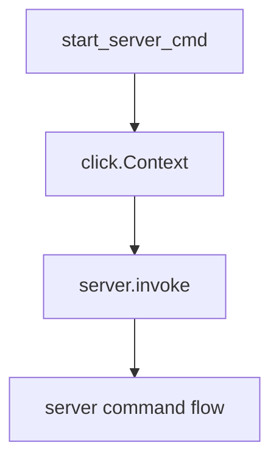

## Command Summary Table

| Command | Primary Function | Key External Calls |
|---------|-----------------|-------------------|
| `server` | Start FastAPI server | `uvicorn.run()`, `webbrowser.open()` |
| `start` | Launch GUI | `subprocess.Popen()` |
| `executors` | List agents | `print_available_executors()` → `AgentManager.list_executors()` |
| `inquirers` | List system instructions | `auto_import_inquirers()`, `print_available_inquirers()` |
| `prompt` | Run inquirer | `inquirer_using_selected_system_instructions()` → `GeminiAPIClient.search_content()` |
| `execute` | Run executor | `create_master_executor()` → `GeminiAPIClient.generate_content()` |
| `config` | Show config | `os.getenv()`, `Path.home()` |
| `shortcut` | Create shortcut | `subprocess.run()` (Windows), print instructions (Linux) |

## Key External Dependencies

### From forgeoagent.controller.executor_controller
- `print_available_executors()` - Lists all saved agents
- `save_last_executor()` - Saves the last executor conversation
- `create_master_executor()` - Main executor creation and execution

### From forgeoagent.controller.inquirer_controller
- `print_available_inquirers()` - Lists system instructions
- `auto_import_inquirers()` - Auto-imports system prompts
- `inquirer_using_selected_system_instructions()` - Runs inquirer mode

### From forgeoagent.clients.gemini_engine
- `GeminiAPIClient` - Main API client class
- `GeminiAPIClient._get_last_conversation_id()` - Retrieves conversation ID

### From forgeoagent.core.managers
- `AgentManager` - Manages agent storage and retrieval
- `PIPInstallManager` - Handles package installation

### From forgeoagent.core
- `PyClassAnalyzer.analyze_dir()` - Analyzes Python classes in directories

### Third-party Libraries
- `click` - CLI framework for all commands
- `uvicorn` - ASGI server for FastAPI
- `subprocess` - Process management
- `webbrowser` - Browser launching
- `dotenv` - Environment variable loading

## CLI Command Structure

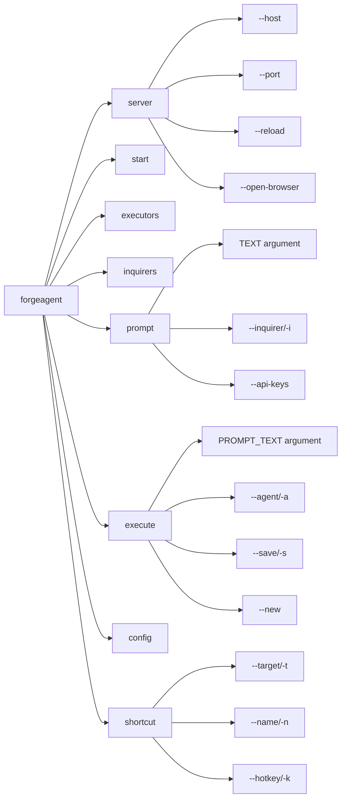

## Notes

> [!IMPORTANT]
> The `main()` function is the primary entry point registered as the `forgeagent` console script. It delegates to the Click CLI group which routes to individual command handlers.

> [!NOTE]
> There's also a `start_server_cmd()` entry point that can be used as a standalone command to start the server directly.

> [!TIP]
> All commands use Click decorators (`@cli.command()`) to register themselves with the CLI group, making the code modular and easy to extend.

> [!WARNING]
> The `execute` and `prompt` commands require `GEMINI_API_KEYS` environment variable to be set, otherwise they will exit with an error.
