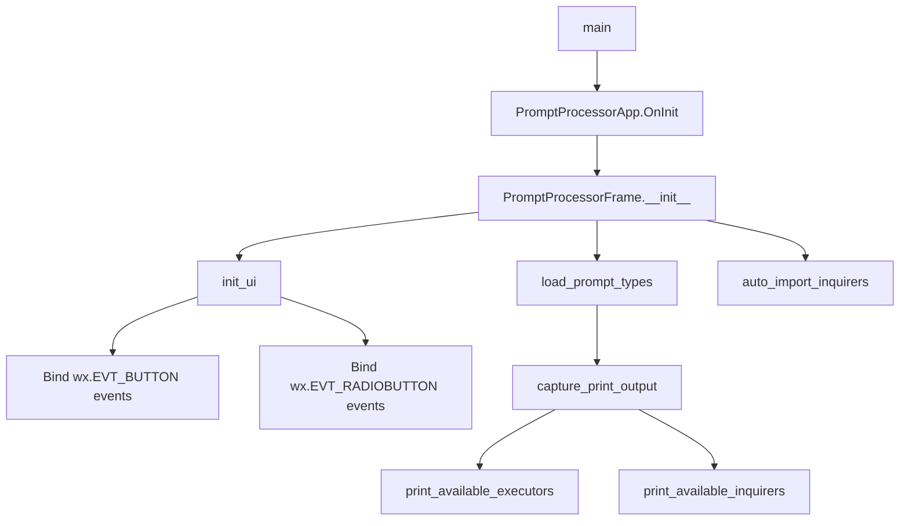
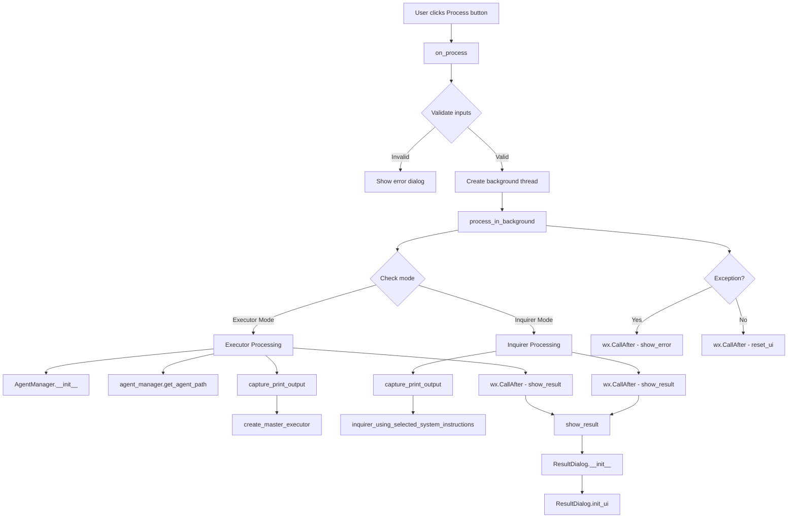
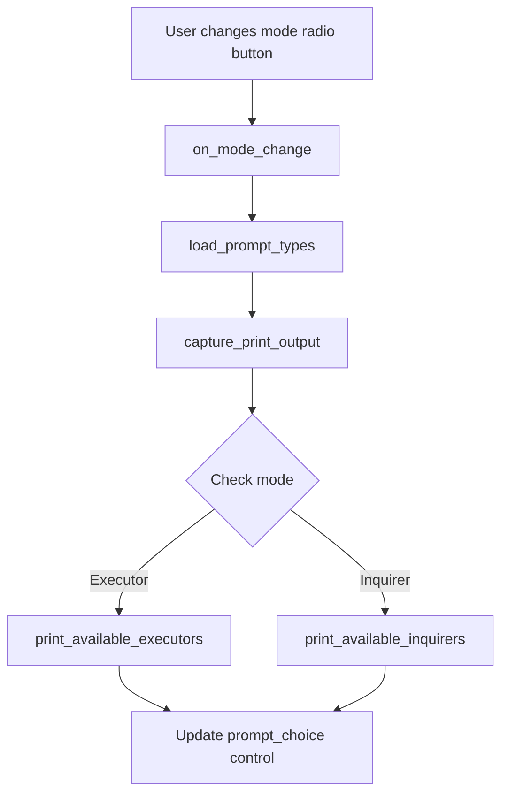
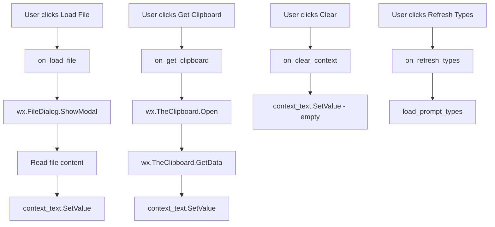
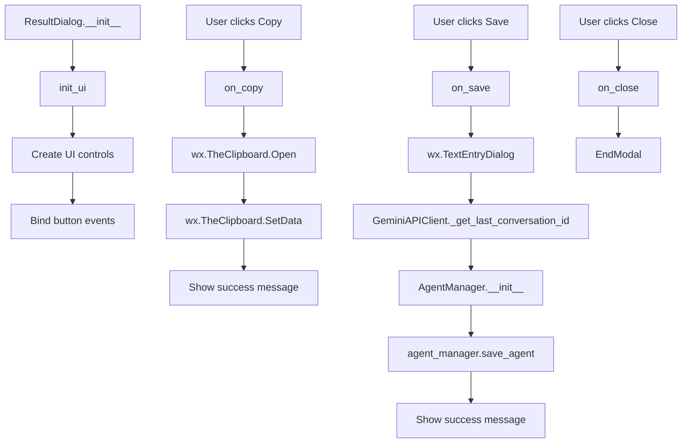
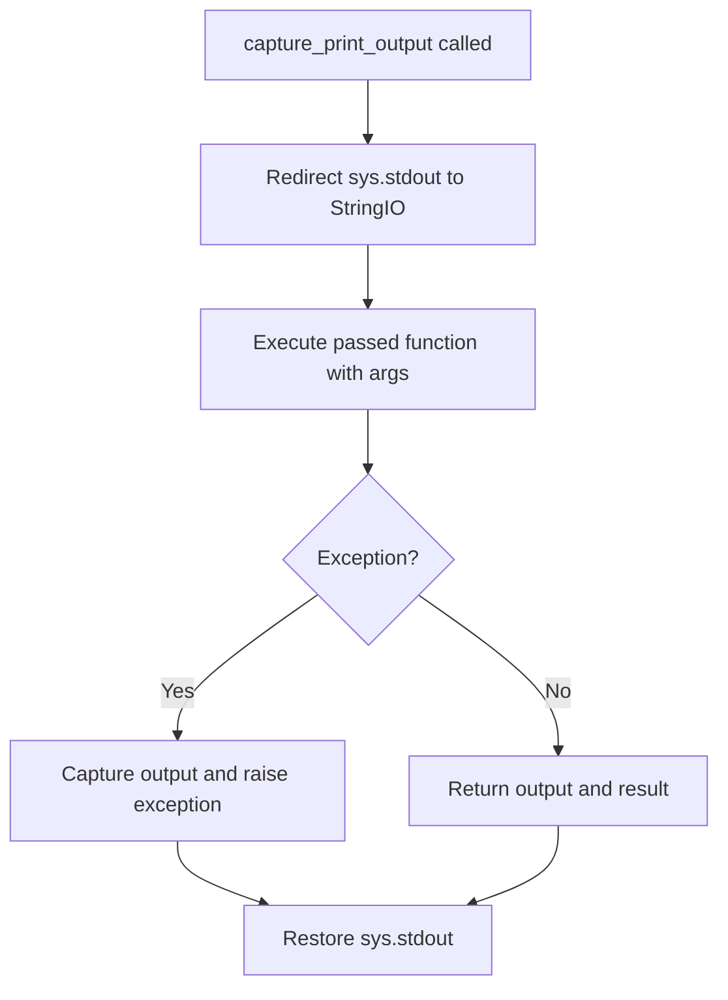

# Method Call Diagram for start.py

This diagram shows the method call flow for the main execution paths in [start.py](file:///home/userpc/29/ForgeOAgent/forgeoagent/start.py).

## Main Entry Point Flow

## User Interaction Flow - Process Button

## Mode Change Flow

## File/Clipboard Operations Flow

## Result Dialog Flow

## Helper Method: capture_print_output

## Key Method Categories

### Initialization Methods
- `main()` - Entry point
- `PromptProcessorApp.OnInit()` - App initialization
- `PromptProcessorFrame.__init__()` - Main frame setup
- `PromptProcessorFrame.init_ui()` - UI component creation
- `ResultDialog.__init__()` - Result dialog setup
- `ResultDialog.init_ui()` - Result dialog UI creation

### Event Handlers
- `on_process()` - Main processing trigger
- `on_mode_change()` - Mode radio button handler
- `on_refresh_types()` - Refresh button handler
- `on_load_file()` - Load file button handler
- `on_get_clipboard()` - Clipboard button handler
- `on_clear_context()` - Clear button handler
- `on_copy()` - Copy to clipboard handler
- `on_save()` - Save result handler
- `on_close()` - Close dialog handler

### Processing Methods
- `process_in_background()` - Background thread processing
- `capture_print_output()` - Utility to capture stdout
- `load_prompt_types()` - Load available prompt types

### UI Update Methods
- `show_result()` - Display processing result
- `show_error()` - Display error message
- `reset_ui()` - Reset UI state after processing

### External Dependencies (from main.py)
- `inquirer_using_selected_system_instructions()` - Inquirer mode processing
- `print_available_inquirers()` - Get available inquirers
- `print_available_executors()` - Get available executors
- `auto_import_inquirers()` - Auto-import system prompts
- `create_master_executor()` - Executor mode processing
- `GeminiAPIClient._get_last_conversation_id()` - Get conversation ID
- `AgentManager.get_agent_path()` - Get agent file path
- `AgentManager.save_agent()` - Save agent result

## Notes

> [!NOTE]
> The file doesn't contain a function explicitly named `action`. The main action flow starts from the `on_process()` event handler when the user clicks the "Process" button.

> [!IMPORTANT]
> Processing happens in a background thread (`process_in_background`) to keep the UI responsive. Results are passed back to the main thread using `wx.CallAfter()`.

> [!TIP]
> The `capture_print_output()` utility method is used extensively to capture stdout from functions that use print statements, allowing the GUI to display their output.
